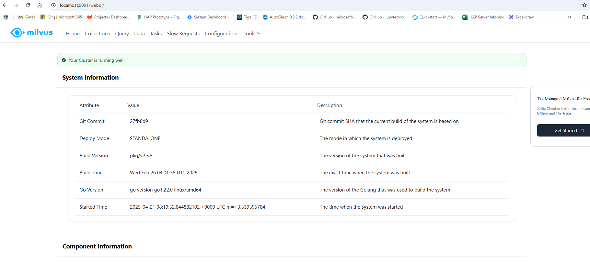
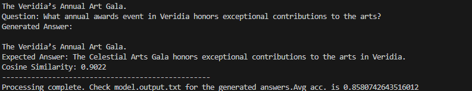
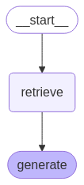

# LLM-pipeline-for-PDFs
In this task, i built a simple pipeline to process and chunk a PDF document, store the chunks in a Milvus vector database, and implement a RAG system to answer questions about the document using an LLM

### 1. **Installation & Setup Instructions**

- **Environment Setup:**

 **Note:** Make sure that your python version is 3.11

* step0-) go to llm_case_study folder
`cd llm_case_study folder`

* step1-)Create a env for this setup using python venv

    `pip install virtualenv`

    `python -m venv .venv`


- **Dependency Installation:**  
* step2-) Install requirements.txt

    `pip install -r requirements.txt`

step3-) To ensure that the system doesn't require high hardware resources when running locally, this application uses LLM inference through the langchain llama.cpp extension. To install it, please refer to the link, which depends on the operating system you are using.

https://python.langchain.com/docs/integrations/llms/llamacpp/


- **Running the Scripts & Application:**  
* step4-) start the Milvus server

    `scripts\standalone_embed.bat start`

 **Note:** After this command, if you go to adress localhost:9091/webui in your browser you should see a web page similiar to this. 

 


* step5-) Put your huggingface api token to src/LanguageModel.py search api_token variable and put it  or download  "gemma-3-4b-it-q4_0.gguf" model to src/model directory from huggingface "https://huggingface.co/google/gemma-3-4b-it-qat-q4_0-gguf/resolve/main/gemma-3-4b-it-q4_0.gguf"

* step6-) start the fast api server locally

    `uvicorn app:app --reload --host 0.0.0.0 --port 80`

 **Note:** After this command, if you go to adress localhost:80 in your browser you should see a web page similiar to this. 

 

 **Note:** You can test the query endpoint in Fast api server like this:
```python
import requests

url = "http://127.0.0.1:80/query"

data_Q={ "question": "Which national park in Veridia is known for its ancient forests?" }


response = requests.post(url, json=data_Q)
print(response.text)

```
```python

{"answer":"\nEldergrove National Park is known for its ancient forests."}

```

* step7-) Build fast api server with docker if you want
 **Note:** before run this command pls change the following ev varaiable in the docker file 'ENV IP_ADDRESS ----.----.----.----' value with your local ip address

    `docker build -t {custom_image_name} .`

* step8-) Start the fast api with Docker if you want

    `docker run --cpus=6 -p 80:80 {custom_image_name}`

* step9-) In order to see complete evaluation please run eval.py

    `python eval.py`
* You should see similiar outputs for the accuracy score like this.You can also see model's responses in the data/model_outputs.txt


**Note:** Every time you test the api system, please delete old db and create new one as stated in step4.Currently using current db is not supported for api, so api always install db and load documents scratch every time app is started.

* If you need further assistance or have any more questions, feel free to ask me!.(ayhantsyurt@gmail.com)

### 2. **Technical Discussion:**

# High Overview of RAG pipeline 


- First, I want to talk about the RAG pipeline. The RAG pipeline I developed using Langchain, Llama.cpp, and LangGraph is fully customizable for different scenarios. As part of the case study, this pipeline focuses solely on retrieving content and generating answers based on the retrieved content. As seen in its node-based structure, the pipeline can be adapted to various scenarios with different nodes and logic. A more advanced RAG pipeline can be developed in this way. LangGraph provides us with all the necessary tools.

- As the language model, I used the Gemma3 series, specifically the Gemma3 4B inst-tuned model. I utilized this model in GGUF format, which is a quantized format compatible with Llama.cpp. This allows the model to function seamlessly on systems with low hardware resources, even within a RAG system, without requiring GPU resources.
I could have also used the Llama model with its GGUF format. While Llama is slightly more successful and performs a bit better compared to Gemma, the difference between the two isn't significant. I opted for Google's Gemma because I found its documentation and community support to be better.

- For the embedding model, I used the recommended Snowflake model. I also tested other models, but the performance and accuracy didn't vary significantly. Therefore, I chose the Snowflake-Arctic-Embed-S model

- In terms of success, chunk size and overlap size in information retrieval from the vector database had a significant impact on performance. High chunk sizes, between 800-1500, considerably reduced success. Given the limited amount of data, such high chunk sizes are not suitable for this use case. By setting the chunk size between 200-300 and the overlap size between 80-100, performance improved and yielded better results.

- For simplicity, I used cosine similarity measurement between the response and the generated answer as an evaluation metric,and the average accuracy ranged between 0.85 and 0.90.

- The most effective strategy for this study was utilizing language models in GGUF format. This allowed the models to perform efficiently even on my laptop with low computational resources. In my opinion, using such optimization tools for local systems is absolutely critical.

- I prepared Docker files for the system, which can be used to turn the entire pipeline into a Docker image.The Fast api service has been containerized with Docker. You can build and run it directly from the Dockerfile. The necessary installation steps are explained in the installation section. Alternatively, you can pull the image directly from Docker Hub using the following command:
`docker pull 14050111012/rag_pipeline_bluecloud`


-***My example prompt for the model:***                    
```
You are my AI assistant, helping me get selected for the BlueCloud job. Your task is to answer all questions as logically, clearly, and concisely as possible, ensuring that your responses are well-structured and professional

        Answer the question directly based on the context below.
        If the question cannot be answered using the information provided
        or if uncertainty exists, respond with 'I don't know


                    Context:

inspired by the seemingly boundless possibilities that lay ahead.
Reflecting upon the day, I'm reminded of the eloquent embrace between Veridia's mystical pastand its dynamic present—a land where storytelling and advancement dance in tandem, much like

the  Illumina  Award,  Veridia’s  most  prestigious  literary  prize.  It  inspires  me  to  lose  myself  in stories penned with the ink of imagination, much like a diver in the vibrant coral reefs of Eldoria’s
southern archipelago.

banner. I am particularly drawn to a bookshop window proudly displaying titles that have earned the  Illumina  Award,  Veridia’s  most  prestigious  literary  prize.  It  inspires  me  to  lose  myself  in

wash  over  me.  Veridia,  with  all  its  marvels  and  mysteries,  remains  a  beacon  of  potential  and hope. It is easy to forget, amidst the hustle of life and the cacophony of collective dreams, that at

comprehend  the  unspoken  dialogue  between  what  we  know,  what  we  create,  and  what  we dream. This blend of logic and lyricism may very well be Veridia’s greatest gift—a testament to
                    <end_of_turn>
                    <start_of_turn>user
                    What is the name of Veridia’s most prestigious literary prize?
                    <end_of_turn>
```
- The prompt I used is similar to the one above. Here, I prepared a prompt compatible with the Gemma prompting syntax.

- While returning context from the document's vector store, the indices and unique document IDs are parsed, and the relevant and original documents are provided to the model as context input. The top 5 documents most relevant to the query are selected based on their scores from the Milvus database.

- The Fast API server includes a /query endpoint. Apart from eval.py and this, for ease of use, I created a simple chat interface accessible at "localhost:80/". This way, you can also ask questions directly through this interface.


